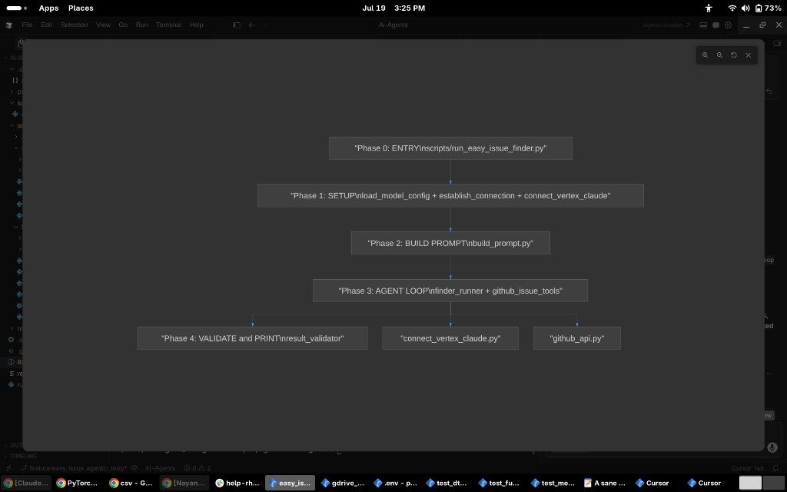

# Ai-Agents

AI agents for finding approachable [PyTorch](https://github.com/pytorch/pytorch) GitHub issues. The project combines a **GitHub Issues MCP server**, **issue summaries with enrichment**, and (in progress) an **agentic triage runner** backed by a **provider-agnostic LLM wrapper** (Anthropic in v1).

**Goal (v1):** return **1** newcomer-friendly issue as JSON.

Implementation plan: `~/.cursor/plans/easy_issue_finder_flow_447218a4.plan.md`

---

## Workflow

The CLI runs four phases in order. Do not skip ahead — each phase is tested before the next starts.



| Phase | What it does | Status |
|-------|--------------|--------|
| **0 — ENTRY** | CLI skeleton: 4 flags, `main()` calls four named steps | **Done** |
| **1 — SETUP** | Load Vertex config from `.env`, establish Claude connection (ADC) | **Done** |
| **2 — BUILD PROMPT** | Load `user.txt`, fill placeholders, build first message for the agent loop | **Done** |
| **3 — AGENT LOOP** | Claude calls `list_issues` via MCP until final JSON or `max_tool_rounds` | **Done** |
| **4 — VALIDATE** | Parse JSON, check schema, print result | Pending |

**Also done (supports Phase 3, not a CLI phase):** GitHub fetch + issue summaries + MCP server.

### Design choices

- **Agentic v1:** The model calls **`list_issues`** (paginate) until it returns **1 easy** issue or hits **`max_tool_rounds`**.
- **Pre-filter in Python:** MCP `list_issues` with `no_linked_prs=True` drops issues that have an open linked PR before the model sees them.
- **Prompt:** [`prompts/easy_issue_finder/user.txt`](prompts/easy_issue_finder/user.txt) loaded by [`build_prompt.py`](src/easy_issue_finder/build_prompt.py) → provider-neutral message dicts for `client.chat()`.
- **Multi-agent:** Shared `fetch_github_issues` + `llm`; agent code under `src/easy_issue_finder/`, prompts under `prompts/`.

### APIs used

| API | Role | Status |
|-----|------|--------|
| GitHub REST (`api.github.com`) | Issues, search, timeline, pulls | In use |
| MCP (stdio) | Cursor integration | In use |
| Anthropic Messages API via Vertex AI | Agent + tool use (ADC) | In use ([`src/llm`](src/llm) + [`agent_loop.py`](src/easy_issue_finder/agent_loop.py)) |
| OpenAI / other LLMs | Alternate providers | Planned (v2) |

---

## Get started

### 1. Clone and install

```bash
git clone <your-repo-url> Ai-Agents
cd Ai-Agents

python -m venv .venv
source .venv/bin/activate          # Windows: .venv\Scripts\activate

pip install -r requirements.txt
```

Requires **Python 3.9+**, [Google Cloud CLI](https://cloud.google.com/sdk/docs/install) (`gcloud`) for Claude on Vertex, and a GitHub token (for MCP / Phase 3).

### 2. Create `.env` in the project root

Copy the block below into `.env` (gitignored). Do **not** commit secrets.

```bash
# GitHub — needed for MCP and Phase 3 agent tools
GITHUB_TOKEN=your_github_token_here

# Claude on Vertex (v1) — no ANTHROPIC_API_KEY
ANTHROPIC_VERTEX_PROJECT_ID=your-team-gcp-project-id
CLOUD_ML_REGION=global
MODEL=claude-sonnet-4@20250514

# Optional
# LLM_MAX_TOKENS=4096
```

| Variable | Required when | Purpose |
|----------|---------------|---------|
| `GITHUB_TOKEN` | MCP, Phase 3 | GitHub REST API ([create PAT](https://github.com/settings/tokens), scope `public_repo`) |
| `ANTHROPIC_VERTEX_PROJECT_ID` | Phase 1 live run | Your team GCP project for Claude on Vertex |
| `CLOUD_ML_REGION` | Optional | Vertex region (default `global`) |
| `MODEL` | Optional | Vertex model id; override with `--model` |
| `LLM_MAX_TOKENS` | Optional | Max tokens per turn (default `4096`) |

### 3. Authenticate to Google Vertex (once per machine)

Run in any terminal on your laptop (not inside Python):

```bash
gcloud auth application-default login
gcloud auth application-default set-quota-project cloudability-it-gemini
```

Sign in with your **Red Hat Google account**. Credentials are stored at `~/.config/gcloud/application_default_credentials.json`. The SDK refreshes tokens automatically — no browser on each run.

Verify:

```bash
gcloud auth application-default print-access-token
```

### 4. Run the CLI

```bash
# No GCP auth needed — prints all phases (config + full prompt); skips API calls
python run_easy_issue_finder.py --dry-run

# Phases 1–3 — loads config, builds prompt, runs agent loop, then stops at Phase 4 stub
python run_easy_issue_finder.py
```

Expected after Phase 3 (live run ends at Phase 4 stub):

```text
Load Config:
  owner=pytorch
  repo=pytorch
  target_easy=1
  max_tool_rounds=10
  model=claude-sonnet-4@20250514
  ...
Config loaded successfully

Build initial message:
<full prompt text>

Prompt ready for the next phase

Find easy issues:
<raw model JSON>

Agent loop complete — ready for validation

Validate result:
Not implemented yet — Phase 4
```

### 5. (Optional) GitHub MCP in Cursor

For browsing issues inside Cursor (separate from the CLI agent):

```bash
python src/mcp_servers/run_mcp_server.py
```

Configure `.cursor/mcp.json` to point at your venv Python. Set `GITHUB_TOKEN` in `.env` or in the MCP config. Restart Cursor after changes.

---

## File structure

Each line: **path** — what the file does.

```text
run_easy_issue_finder.py             # CLI entry: parse args, run phases 0→1→2→3→4 in order

src/mcp_servers/run_mcp_server.py      # Start GitHub Issues MCP server for Cursor (stdio)
src/mcp_servers/server_tools.py        # MCP tools: list_issues, get_issue
src/mcp_servers/connect_stdio_server.py  # MCP stdio client for agent loop

src/llm/load_model_config.py         # Read MODEL, Vertex project/region from .env → ModelSettings
src/llm/create_llm_connection.py     # Pick LLM backend (v1: Vertex) and establish_connection()
src/llm/connect_vertex_claude.py     # Wrap AnthropicVertex SDK + ADC + chat()
src/llm/build_chat_messages.py       # user/assistant/tool message dicts for client.chat()
src/llm/model_reply_dataclass.py     # ModelReply and ToolRequest dataclasses for one model turn
src/llm/__init__.py                  # Package docstring only; import submodules explicitly

src/fetch_github_issues.py           # Fetch issues from GitHub REST + compact summaries
src/easy_issue_finder/build_prompt.py   # Phase 2: load user.txt, build first messages
src/easy_issue_finder/agent_loop.py     # Phase 3: tool-use loop via MCP until 1 easy issue
src/easy_issue_finder/__init__.py       # easy_issue_finder agent package

prompts/easy_issue_finder/user.txt      # Prompt template with <<<PLACEHOLDER>>> slots
prompts/easy_issue_finder/__init__.py   # Package marker (template lives in user.txt)

requirements.txt                     # Python dependencies (includes anthropic[vertex])
.env                                 # Your secrets and config (create locally, gitignored)
```

**Planned (not created yet):**

```text
src/easy_issue_finder/result_validator.py   # Phase 4: parse and validate final JSON
```

**Import style:** use explicit paths, e.g. `from llm.create_llm_connection import establish_connection` — not `from llm import ...`.

---

## Completed phases

### Phase 0 — ENTRY (Done)

**What shipped:** [`run_easy_issue_finder.py`](run_easy_issue_finder.py) with six CLI flags, path setup, `.env` loading, and `main()` calling four named step functions.

**Call chain (dry-run):**

```text
main()
  ├─ setup_project_paths()      # add src/ and repo root to sys.path
  ├─ load_env_file()            # load .env
  ├─ parse_args()               # --owner, --repo, --model, --target-easy, --max-tool-rounds, --dry-run
  └─ print_cli_config(args)     # print config; exit (no API calls)
```

**Call chain (normal run, through Phase 2):**

```text
main()
  ├─ setup_project_paths()
  ├─ load_env_file()
  ├─ parse_args()
  ├─ create_chat_client(args)     # Phase 1 — Load Config + establish_connection
  └─ build_start_messages(args)   # Phase 2 — build_initial_messages → find_easy_issues stub
```

**How to test Phase 0:**

```bash
python run_easy_issue_finder.py --help
# Expect: 6 flags (--owner, --repo, --model, --target-easy, --max-tool-rounds, --dry-run)

python run_easy_issue_finder.py --dry-run
# Expect phased output:
#   Load Config: (owner, repo, model, vertex_project, vertex_region, max_tokens, auth)
#   Config loaded successfully (dry-run — no API calls)
#   Build initial message: (full prompt)
#   Prompt ready for the next phase (dry-run)
#   Find easy issues: Skipped — dry-run
#   Validate result: Skipped — dry-run
# No gcloud login or .env project id required for dry-run.
```

---

### Phase 1 — SETUP (Done)

**What shipped:** Vertex + ADC LLM layer under [`src/llm/`](src/llm/). Constructs `AnthropicVertex` from `.env` and implements `VertexClaudeClient.chat()` for the agent loop.

**Call chain:**

```text
create_chat_client(args)                          # run_easy_issue_finder.py
  ├─ load_model_settings(model=args.model)        # src/llm/load_model_config.py
  │    # reads MODEL, ANTHROPIC_VERTEX_PROJECT_ID, CLOUD_ML_REGION
  │    # order: --model → MODEL env → default claude-sonnet-4@20250514
  ├─ _print_config(args, settings)                # CLI: Load Config section
  └─ establish_connection(settings)               # src/llm/create_llm_connection.py
       └─ VertexClaudeClient(settings)            # src/llm/connect_vertex_claude.py
            └─ AnthropicVertex(project_id, region)  # uses ADC from gcloud login
  # prints: Config loaded successfully
```

**How to test Phase 1:**

```bash
# Prerequisites: pip install -r requirements.txt
#               gcloud auth application-default login (see Get started)
#               ANTHROPIC_VERTEX_PROJECT_ID in .env

python run_easy_issue_finder.py --dry-run --model claude-test-override
# Expect: model=claude-test-override  (--model wins over MODEL in .env)

python run_easy_issue_finder.py
# Expect phased output through Phase 3, then:
#   Validate result:
#   Not implemented yet — Phase 4

# Fail-fast test: unset ANTHROPIC_VERTEX_PROJECT_ID, run without --dry-run
# Expect: ValueError: ANTHROPIC_VERTEX_PROJECT_ID is required...
```

---

### Phase 2 — BUILD PROMPT (Done)

**What shipped:** [`src/easy_issue_finder/build_prompt.py`](src/easy_issue_finder/build_prompt.py) loads [`prompts/easy_issue_finder/user.txt`](prompts/easy_issue_finder/user.txt), fills placeholders, and returns provider-neutral message dicts via `user_message()`. The CLI prints each phase in order with a labeled header and success line.

**Call chain:**

```text
build_start_messages(args)                          # run_easy_issue_finder.py
  └─ build_initial_messages(owner, repo)            # src/easy_issue_finder/build_prompt.py
       ├─ load_easy_issue_finder_prompt(...)        # read user.txt, fill <<<PLACEHOLDER>>> slots
       │    issues_json="[]" at start (model fetches via tools in Phase 3)
       └─ user_message(prompt)                      # src/llm/build_chat_messages.py
            └─ [{"role": "user", "content": "..."}]  # passed to client.chat() in Phase 3
```

Placeholders in `user.txt`:

| Placeholder | Source |
|-------------|--------|
| `<<<OWNER>>>` | CLI `--owner` |
| `<<<REPO>>>` | CLI `--repo` |
| `<<<ISSUES_JSON>>>` | `"[]"` at start; tool results in Phase 3 |
| `<<<TARGET_EASY_COUNT>>>` | Default `1` |
| `<<<MAX_ISSUES_CAP>>>` | Default `1000` |

**How to test Phase 2:**

```bash
python run_easy_issue_finder.py --dry-run
# Expect: Load Config → full prompt under Build initial message → dry-run skips for Phases 3–4

python run_easy_issue_finder.py
# Expect: Load Config → Config loaded successfully → full prompt → agent loop raw JSON
#         → Agent loop complete — ready for validation
#         → Validate result: Not implemented yet — Phase 4

python -c "
import sys; sys.path.insert(0, 'src')
from easy_issue_finder.build_prompt import build_initial_messages
m = build_initial_messages(owner='pytorch', repo='pytorch')
assert m[0]['role'] == 'user' and 'pytorch' in m[0]['content'] and '[]' in m[0]['content']
print('ok', len(m[0]['content']), 'chars')
"
```

---

### Phase 3 — AGENT LOOP (Done)

**What shipped:** Full agent loop in three layers:

| Sub-phase | File | What it does |
|-----------|------|--------------|
| **3a** | [`src/llm/connect_vertex_claude.py`](src/llm/connect_vertex_claude.py) | `VertexClaudeClient.chat()` — message mapping + `ModelReply` |
| **3b** | [`src/mcp_servers/connect_stdio_server.py`](src/mcp_servers/connect_stdio_server.py) | MCP stdio client — spawn server, `list_tool_definitions`, `call_tool_text` |
| **3c** | [`src/easy_issue_finder/agent_loop.py`](src/easy_issue_finder/agent_loop.py) | `run_finder()` — multi-turn loop via MCP + `client.chat()` |

**Call chain:**

```text
find_easy_issues(client, messages, args, project_root)   # run_easy_issue_finder.py
  └─ run_finder(client, config, messages, project_root)  # src/easy_issue_finder/agent_loop.py
       ├─ open_stdio_session(src/mcp_servers/run_mcp_server.py)
       ├─ list_tool_definitions(session)                 # tools for client.chat()
       loop max_tool_rounds:
         ├─ client.chat(messages, tools=tools)            # src/llm/connect_vertex_claude.py
         ├─ assistant_message() / tool_result()           # src/llm/build_chat_messages.py
         └─ call_tool_text(session, name, args)           # src/mcp_servers/connect_stdio_server.py
              └─ run_mcp_server → server_tools → fetch_github_issues
```

**CLI flags added in Phase 3:**

| Flag | Default | Purpose |
|------|---------|---------|
| `--target-easy` | `1` | Passed to prompt + `FinderConfig.target_easy_count` |
| `--max-tool-rounds` | `10` | Max LLM ↔ tool iterations |

**Linked-PR filter:** `run_finder` always passes `no_linked_prs=True` on `list_issues` (exclude issues with an open linked PR).

**How to test Phase 3:**

```bash
# 3a — chat() smoke test (needs ADC + ANTHROPIC_VERTEX_PROJECT_ID)
python -c "
from dotenv import load_dotenv; load_dotenv('.env')
import sys; sys.path.insert(0, 'src')
from llm.create_llm_connection import establish_connection
from llm.build_chat_messages import user_message
c = establish_connection()
r = c.chat([user_message('Reply with exactly: ok')])
print(r.text.strip())
"

# 3b — MCP client only (needs GITHUB_TOKEN)
PYTHONPATH=src python -c "
import asyncio
from pathlib import Path
from dotenv import load_dotenv
load_dotenv('.env')
from mcp_servers.connect_stdio_server import open_stdio_session, list_tool_definitions, call_tool_text
async def main():
    async with open_stdio_session(Path('src/mcp_servers/run_mcp_server.py')) as session:
        tools = await list_tool_definitions(session)
        print([t['name'] for t in tools])
        print((await call_tool_text(session, 'list_issues', {'owner':'pytorch','repo':'pytorch','page':1,'per_page':2}))[:200])
asyncio.run(main())
"

# 3c — full pipeline through agent loop (needs GITHUB_TOKEN, ADC)
python run_easy_issue_finder.py --owner pytorch --repo pytorch
# Expect: Find easy issues → raw JSON → Agent loop complete — ready for validation
#         → Validate result: Not implemented yet — Phase 4
```

**Known gap:** [`user.txt`](prompts/easy_issue_finder/user.txt) does not yet instruct the model to call `list_issues` when `ISSUES_JSON=[]`; the model may return `exhausted_input` without fetching. Prompt update is a follow-up.

---

## Pending phases (reference)

### Phase 4 (summary)

| Phase | Call chain (planned) | How to test (when built) |
|-------|----------------------|---------------------------|
| **4 — VALIDATE** | `validate_and_print_result` → `result_validator` | Full run prints validated JSON |

**Removed from pending:** Phase 3 agent loop (done — see above).

---

## End-state command

When all phases are wired:

```bash
python run_easy_issue_finder.py \
  --owner pytorch --repo pytorch \
  --model claude-sonnet-4@20250514
```

---

## MCP tools (Cursor)

| Tool | Description |
|------|-------------|
| `list_issues` | List issues; `no_linked_prs=True` drops rows with an open linked PR (always on in agent loop) |
| `get_issue` | Full issue JSON by number |

Issue summary fields from `list_issues`: `assignees`, `open_linked_pr`, `body_excerpt`, `labels`, `html_url`, …

---

## Conventions

- **File names** describe what the file does (`load_model_config.py`, not `utils.py`).
- **Function names** are the specific action inside that file (`load_model_settings()`, `establish_connection()`).
- **Module docstrings:** purpose, who calls it, what it does not do.
- Update this README when a phase is completed.
