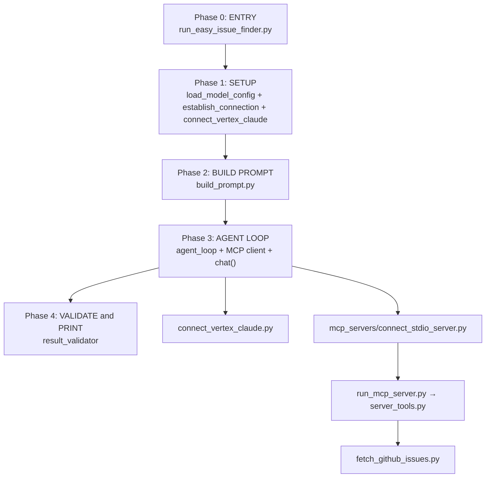

# Easy Issue Finder — Implementation Plan

Ordered implementation: Phase 0 (CLI entry) → Phase 1 (SETUP) → Phase 2 (prompt) → Phase 3 (agent loop) → Phase 4 (validate). Each phase is testable before the next starts.

**Status (2026-07-20):** Phases 0–3 **done**. Phase 4 **pending**.

| Phase | Status |
|-------|--------|
| 0 — ENTRY | Done |
| 1 — SETUP | Done |
| 2 — BUILD PROMPT | Done |
| 3 — AGENT LOOP (3a chat, 3b MCP client, 3c agent loop) | Done |
| 4 — VALIDATE | **Next** |

---

## What you run (end state)

```bash
python run_easy_issue_finder.py \
  --owner pytorch --repo pytorch \
  --model claude-sonnet-4@20250514
```

Auth: Application Default Credentials (`gcloud auth application-default login`) — no API key in v1.



---

## Current state: done vs not done

| Phase | Status | Files |
|-------|--------|-------|
| **0. ENTRY** | **Done** | [`run_easy_issue_finder.py`](../run_easy_issue_finder.py) — 6 flags, named step functions |
| **1. SETUP** | **Done** | [`src/llm/`](../src/llm/) — includes `chat()` in `connect_vertex_claude.py` |
| **2. BUILD PROMPT** | **Done** | [`src/easy_issue_finder/build_prompt.py`](../src/easy_issue_finder/build_prompt.py) |
| **3. AGENT LOOP** | **Done** | [`src/easy_issue_finder/agent_loop.py`](../src/easy_issue_finder/agent_loop.py), [`src/mcp_servers/`](../src/mcp_servers/) |
| **4. VALIDATE** | **Not started** | `result_validator.py` (planned) |
| **GitHub + MCP** | **Done** | [`fetch_github_issues.py`](../src/fetch_github_issues.py), [`server_tools.py`](../src/mcp_servers/server_tools.py), [`run_mcp_server.py`](../src/mcp_servers/run_mcp_server.py) |

---

## File map

```text
run_easy_issue_finder.py             # CLI entry: orchestrates 1→2→3→4

src/mcp_servers/
  run_mcp_server.py                  # MCP stdio entry (Cursor + agent subprocess)
  server_tools.py                    # list_issues, get_issue
  connect_stdio_server.py            # MCP client for agent loop

src/llm/
  load_model_config.py
  create_llm_connection.py
  connect_vertex_claude.py           # includes chat()
  build_chat_messages.py
  model_reply_dataclass.py

src/fetch_github_issues.py           # GitHub REST fetch + summaries

src/easy_issue_finder/
  build_prompt.py                    # Phase 2
  agent_loop.py                      # Phase 3
  result_validator.py                # Phase 4 (planned)

prompts/easy_issue_finder/user.txt
```

**Read order:** `run_easy_issue_finder.py` → `src/easy_issue_finder/` → `src/mcp_servers/` → `src/llm/`

---

## Phase 0 — ENTRY ✅

CLI front door with phased `main()`:

```python
client = create_chat_client(args)       # Phase 1
messages = build_start_messages(args)   # Phase 2
raw_result = find_easy_issues(...)      # Phase 3
validate_and_print_result(raw_result)   # Phase 4 (stub)
```

**CLI flags:**

| Flag | Default | Purpose |
|------|---------|---------|
| `--owner` | `pytorch` | GitHub owner |
| `--repo` | `pytorch` | GitHub repo |
| `--model` | none | Overrides `MODEL` env |
| `--target-easy` | `1` | Easy issues to find |
| `--max-tool-rounds` | `10` | Max LLM ↔ tool iterations |
| `--dry-run` | off | Config + prompt preview, no API calls |

---

## Phase 1 — SETUP ✅

Load Vertex config from `.env`, construct `AnthropicVertex` via ADC. Phase 1 does **not** call Claude — first HTTP request is in Phase 3a `chat()`.

**Key chain:** `load_model_settings()` → `establish_connection()` → `VertexClaudeClient`

**Required env:** `ANTHROPIC_VERTEX_PROJECT_ID`

---

## Phase 2 — BUILD PROMPT ✅

Load [`prompts/easy_issue_finder/user.txt`](../prompts/easy_issue_finder/user.txt), fill placeholders, return `[user_message(prompt)]` with `issues_json="[]"`. Model fetches issues via tools in Phase 3.

---

## Phase 3 — AGENT LOOP ✅

### Architecture

The CLI agent calls tools through the **same MCP server** as Cursor — no in-process duplicate of GitHub tools.

```text
Cursor IDE ──stdio──► run_mcp_server.py ──► server_tools.py ──► fetch_github_issues.py
CLI agent  ──stdio──► run_mcp_server.py ──► server_tools.py ──► fetch_github_issues.py
```

```text
agent_loop.run_finder()
  ├─ open_stdio_session(src/mcp_servers/run_mcp_server.py)
  ├─ list_tool_definitions(session)
  ├─ client.chat(messages, tools=...)
  └─ call_tool_text(session, name, args)
```

**Linked-PR filter:** `run_finder` always passes `no_linked_prs=True` on `list_issues` (exclude issues with an open linked PR). Not a CLI flag.

### 3a — `VertexClaudeClient.chat()` ✅

[`src/llm/connect_vertex_claude.py`](../src/llm/connect_vertex_claude.py): maps neutral message dicts ↔ Anthropic Vertex API, returns `ModelReply`.

### 3b — MCP client ✅

[`src/mcp_servers/connect_stdio_server.py`](../src/mcp_servers/connect_stdio_server.py): `open_stdio_session`, `list_tool_definitions`, `call_tool_text`.

### 3c — Agent loop + CLI wiring ✅

[`src/easy_issue_finder/agent_loop.py`](../src/easy_issue_finder/agent_loop.py): `FinderConfig`, `run_finder()`.

**Test (full pipeline):**

```bash
python run_easy_issue_finder.py --owner pytorch --repo pytorch
# Expect: raw JSON under Find easy issues → Phase 4 stub
```

**Known gap:** `user.txt` does not yet instruct the model to call `list_issues` when `ISSUES_JSON=[]`; model may return `exhausted_input` without fetching.

---

## Phase 4 — VALIDATE ← **START HERE**

### Planned: [`result_validator.py`](../src/easy_issue_finder/result_validator.py)

- `extract_json(text)` — strip fences, parse
- `validate_result(data, target_easy=1)` — schema check

### Wire `validate_and_print_result(raw_result)`

Parse + validate; pretty-print JSON. Replace Phase 4 stub in [`run_easy_issue_finder.py`](../run_easy_issue_finder.py).

---

## Implementation order

| Step | Phase | Deliverable | Status |
|------|-------|-------------|--------|
| 1 | 0 ENTRY | CLI skeleton + named steps | ✅ |
| 2 | 1 SETUP | LLM layer + `create_chat_client()` | ✅ |
| 3 | 2 PROMPT | `build_prompt.py` + CLI wiring | ✅ |
| 4 | 3a | `chat()` in `connect_vertex_claude.py` | ✅ |
| 5 | 3b | `connect_stdio_server.py` | ✅ |
| 6 | 3c | `agent_loop.py` + CLI flags | ✅ |
| 7 | 4 VALIDATE | `result_validator.py` + CLI | Pending |
| 8 | — | README Phase 4 update | Pending |

---

## Not in v1 scope

- Direct API keys (`ANTHROPIC_API_KEY`, `OPENAI_API_KEY`) — v2
- In-process duplicate of MCP tools (`github_issue_tools.py`)
- `from llm import ...` re-exports — use explicit submodule imports
- Caching, GraphQL, pytest (later)

---

## Conventions

- **File names** describe what the file does; **function names** are the specific action.
- Every module docstring: **Purpose**, **Who calls it**, **What it does not do**.
- Agent code stays provider-neutral; only `connect_vertex_claude.py` imports `anthropic`.
